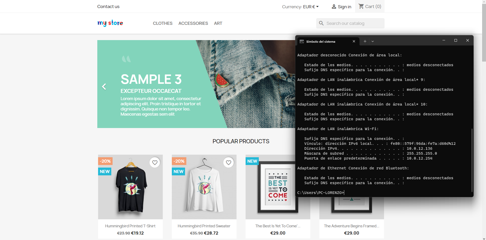
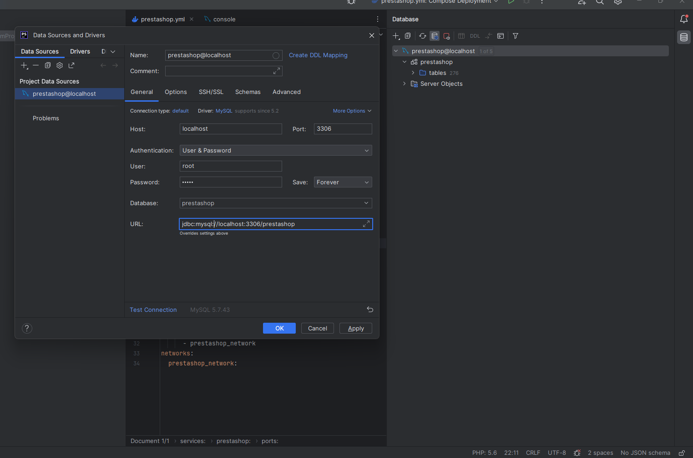

## Requisitos

- Docker: Asegúrate de que Docker esté instalado en tu sistema. Puedes descargarlo desde [https://www.docker.com/get-started](https://www.docker.com/get-started).

## Instrucciones


1. Crea archivo `docker-compose.yml` en un editor de texto. Este archivo define los servicios y la configuración necesaria para ejecutar Prestashop en contenedores Docker.

   ```yaml
   version: '3'
    services:
        mysql:
            container_name: some-mysql
            image: mysql:5.7
            restart: unless-stopped
        environment:
            MYSQL_ROOT_PASSWORD: admin
            MYSQL_DATABASE: prestashop
            MYSQL_USER: mysql
            MYSQL_PASSWORD: mysql
        ports:
            - 3306:3306
        networks:
        - prestashop_network
    prestashop:
        container_name: prestashop
        image: prestashop/prestashop:latest
        restart: unless-stopped
        depends_on:
            - mysql
        ports:
            - 8080:80
        environment:
            DB_SERVER: some-mysql
            DB_NAME: prestashop
            DB_USER: root
            DB_PASSWD: admin
            PS_INSTALL_AUTO: 1
            PS_DOMAIN: localhost:8080
        networks:
            - prestashop_network
    networks:
        prestashop_network:
   ```

   Los parámetros más importantes en este archivo son:

   - `image`: Especifica la imagen Docker que se utilizará para cada servicio. En este caso, se utiliza la imagen oficial de MySQL para la base de datos y la imagen oficial de Prestashop para el sitio web.

   - `ports`: Mapea los puertos del contenedor a los puertos del host.

   - `volumes`: Define los volúmenes Docker para persistir datos. En este caso, se utilizan dos volúmenes, uno para la base de datos y otro para los archivos de Prestashop.

   - `environment`: Establece variables de entorno necesarias para la configuración de MySQL y Prestashop, como contraseñas y nombres de bases de datos.

2. Una vez que hayas revisado y personalizado el archivo `docker-compose.yml`, ejecuta el siguiente comando para iniciar el entorno:

   ```bash
   docker-compose up -d
   ```

   Esto creará y ejecutará los contenedores en segundo plano.

3. Abre un navegador web y navega a `http://localhost:8080`. Deberías ver la página de Prestashop creada.

4. ¡Listo! Ahora deberías tener Prestashop funcionando en tu sistema utilizando Docker Compose.

## Captura de pantalla

Adjunto una captura de pantalla de Prestashop funcionando:



## Conexion DB

Desde phpStorm añadir una base de datos y rellenar los campos con el usuario, la contraseña y la base de datos a la que se quiere acceder.

